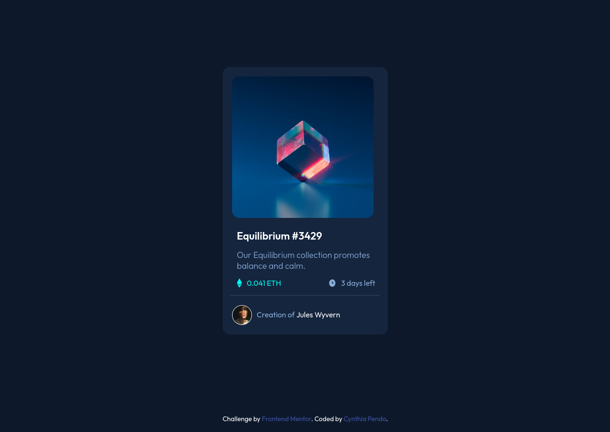

# Frontend Mentor - NFT preview card component solution

This is a solution to the [NFT preview card component challenge on Frontend Mentor](https://www.frontendmentor.io/challenges/nft-preview-card-component-SbdUL_w0U). 

## Table of contents

- [Overview](#overview)
- [The challenge](#the-challenge)
- [Screenshot](#screenshot)
- [Built with](#built-with)
- [Useful resources](#useful-resources)
- [Author](#author)

## Overview

The challenge is to build a preview card and get it looking as close as possible to the provided design templates using any tools available.

### The challenge

Users should be able to:

- View the optimal layout depending on their device's screen size
- See hover states for interactive elements

### Screenshot

This is a screenshot of my solution. 

### Built with

- HTML
- CSS 

### Useful resources

- [https://www.w3schools.com/howto/howto_css_image_overlay_icon.asp- This W3 school how to page was really helpful in the implementation of css overlay property.

## Author

-Cynthia Pendo
